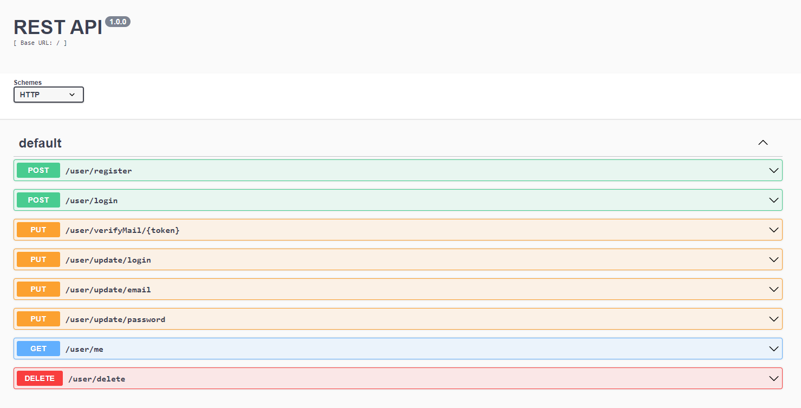

# ExpressJS user

Initialisation d'un projet ExpressJS/MongoDB comprenant une gestion basique d'utilisateur

### Base de donnée

- ```MongoDB```

### Initialisation

- ```npm install```
- ```npm run start```

### Fonctionalité

- ```Gestion des variable d'environement dans le fichier .env (dotenv)```
- ```Gestion de compte utilisateur basic (CRUD)```
- ```Vérification d'email (email de confirmation)```
- ```Swagger automatiser au lancement du serveur```
- ```Gestion administrateur des utilisateur (work in progress)```

### Documentation

- ```server.js > routes > controllers > services > models```
- ```http://localhost:4200/api```


